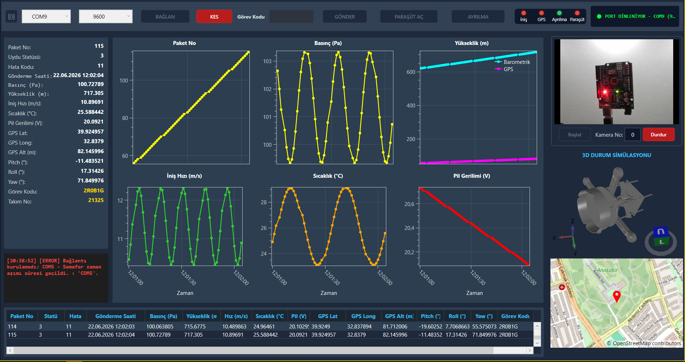
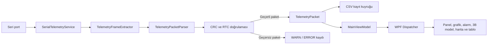

# teknofest-uydu-arayuz

`teknofest-uydu-arayuz`, bir model uydudan seri port üzerinden alınan ikili telemetri verilerini doğrulamak, kaydetmek ve gerçek zamanlı olarak görselleştirmek amacıyla geliştirilmiş bir Windows yer istasyonu uygulamasıdır.

Uygulama; anlık telemetri panelini, zaman serisi grafiklerini, hata göstergelerini, sesli alarmı, GPS haritasını, üç boyutlu durum göstergesini, paket geçmişini ve USB kamera görüntüsünü tek bir WPF arayüzünde bir araya getirir. Görev komutları  yalnızca açık `COM6` bağlantısı üzerinden gönderilebilir. Alternatif konfigrasyonlar kod değişikliği ile yapılabilir.



## Temel özellikler

- Seri port ve baud rate seçerek telemetri bağlantısı kurma
- Parçalı seri port okumalarından sabit uzunluklu paket çıkarma
- Başlangıç/bitiş işareti, paket uzunluğu, RTC ve CRC doğrulaması
- Basınç, yükseklik, iniş hızı, sıcaklık, batarya ve paket numarası grafikleri
- Son doğrulanmış paketin anlık gösterimi
- Son 100 doğrulanmış paketin tabloda tutulması
- Hata koduna göre alarm LED'leri ve sesli uyarı
- GPS konumunun OpenStreetMap üzerinde gösterilmesi
- Pitch, roll ve yaw verileriyle STL modelinin döndürülmesi
- OpenCV üzerinden USB kamera görüntüsü
- Doğrulanmış telemetri paketlerinin CSV olarak kaydedilmesi
- WARN ve ERROR kayıtlarının ekranda ve kalıcı TXT dosyasında tutulması
- Ayrılma, acil paraşüt ve görev kodu komutlarının gönderilmesi

## Kullanılan teknolojiler

| Teknoloji | Kullanım amacı |
| --- | --- |
| .NET 8 / WPF | Masaüstü uygulaması ve kullanıcı arayüzü |
| System.IO.Ports | Seri port haberleşmesi |
| OxyPlot.Wpf | Gerçek zamanlı telemetri grafikleri |
| Mapsui.Wpf | OpenStreetMap tabanlı konum gösterimi |
| HelixToolkit.Wpf | Üç boyutlu uydu durum göstergesi |
| OpenCvSharp4.Windows | USB kameradan görüntü yakalama |
| System.Threading.Channels | Telemetri ve uygulama kayıt kuyrukları |

## Mimari

Proje, WPF ile uyumlu MVVM yaklaşımını temel alır. Sorumluluklar kullanıcı arayüzü, görünüm modelleri, servisler, veri modeli ve dış sistem adaptörleri arasında ayrılmıştır.

```text
App / MainWindow
    └── MainViewModel
        ├── HeaderControlViewModel
        ├── AlarmPanelViewModel
        ├── GraphDashboardViewModel
        ├── AttitudeViewModel
        ├── MapViewModel
        ├── SerialTelemetryService
        │   └── TelemetryFrameProcessor
        │       ├── TelemetryFrameExtractor
        │       ├── TelemetryPacketParser
        │       ├── TelemetryCrc32
        │       └── TelemetryCsvRecorder
        ├── LoggerService
        │   └── ApplicationLogRecorder
        └── AlarmSoundService
```

### Arayüz ve ViewModel katmanı

`MainWindow`, uygulamanın ana penceresidir ve `MainViewModel` örneğini `DataContext` olarak kullanır. Alt ekran bileşenleri kendi ViewModel'lerine bağlanır:

- `HeaderControl`: bağlantı ayarları, sistem durumu ve görev komutları
- `InstantTelemetryPanel`: son doğrulanmış telemetri paketi
- `GraphDashboard`: son 60 ölçümü gösteren grafikler
- `TelemetryTable`: son 100 paketin geçmişi
- `LogPanel`: son 20 WARN veya ERROR kaydı
- `AttitudeIndicator`: üç boyutlu uydu modeli
- `Map`: güncel GPS konumu
- `LiveCameraView`: USB kamera kontrolü ve görüntüsü

Seri port verileri arka plan görevinde işlendiği için UI'a bağlı property ve koleksiyonlar doğrudan bu görevden değiştirilmez. `MainViewModel`, doğrulanmış paketleri WPF `Dispatcher` kuyruğuna aktararak kullanıcı arayüzü güncellemelerinin UI thread'inde yapılmasını sağlar.

### Servis katmanı

`SerialTelemetryService`, seri portun açılması, okunması, komut yazılması ve güvenli biçimde kapatılmasından sorumludur. Paket içeriğinin yorumlanması bu sınıfta yapılmaz; bu sorumluluk `TelemetryFrameProcessor` ve onun kullandığı protokol bileşenlerine bırakılmıştır.

Bu ayrım, seri port yaşam döngüsü ile telemetri protokolünün birbirinden bağımsız biçimde incelenebilmesini ve geliştirilebilmesini sağlar.

### Kamera adaptörü

`OpenCvUsbCameraPlaybackAdapter`, USB kamera erişimini WPF görüntü bileşeninden ayırır. Kamera önce DirectShow, başarısız olursa Media Foundation arka ucuyla açılır. Yakalanan kare bir `BitmapSource` nesnesine dönüştürülüp dondurulur; UI kuyruğunda yalnızca en yeni kare tutulur. Böylece arayüz yavaşladığında eski karelerin birikmesi engellenir.

## Telemetri veri akışı



Akışın temel adımları şunlardır:

1. Seri porttan gelen baytlar arka plan görevinde okunur.
2. `TelemetryFrameExtractor`, parçalı okumaları tamponlar ve tam 80 baytlık çerçeveleri ayırır.
3. `TelemetryPacketParser`; uzunluk, başlangıç işareti, bitiş işareti, CRC ve RTC alanlarını doğrular.
4. Yalnızca geçerli çerçeveler değiştirilemez özelliklere sahip bir `TelemetryPacket` nesnesine dönüştürülür.
5. Geçerli paket CSV kayıt kuyruğuna eklenir ve `OnTelemetryReceived` olayıyla `MainViewModel` katmanına iletilir.
6. `MainViewModel`, UI güncellemesini Dispatcher üzerinden gerçekleştirir.
7. Geçersiz paketler kullanıcı arayüzüne aktarılmaz; hata türüne göre loglanır.

## Telemetri protokolü

Protokol sabitleri `Services/TelemetryProtocol.cs` içinde merkezi olarak tanımlanmıştır.

- Paket uzunluğu: `80` bayt
- Başlangıç işareti: `3C 3C 3C 3C`
- Bitiş işareti: `3E 3E 3E 3E`
- Sayısal alanların byte sırası: little-endian
- Görev kodu: offset `62`, uzunluk `6` ASCII karakter
- Takım numarası: offset `68–71`
- CRC: offset `72–75`
- Bitiş alanı: offset `76–79`

CRC, ilk 72 bayt üzerinde STM32 uyumlu `0x04C11DB7` polinomu kullanılarak hesaplanır. CRC veya diğer doğrulamalardan geçmeyen çerçeveler telemetri ekranına ve CSV kaydına alınmaz.

Paket içerisinde şu bilgiler taşınır:

- Paket numarası
- Uydu durumu
- Hata kodu
- RTC zamanı
- Basınç
- Barometrik yükseklik
- İniş hızı
- Sıcaklık
- Batarya gerilimi
- GPS enlem, boylam ve irtifa
- Pitch, roll ve yaw
- Görev kodu
- Takım numarası

## Görev komutları

Telemetri farklı seri portlardan dinlenebilir. Komut gönderimi ise hem kullanıcı arayüzünde hem servis katmanında yeniden doğrulanarak yalnızca açık `COM6` bağlantısına izin verir.

| Komut | Gönderilen 4 bayt |
| --- | --- |
| Ayrılma | `00 00 00 00` |
| Acil paraşüt | `01 00 00 00` |
| Görev kodu | `AA` + sayısal `0`, `1` veya `2` değerlerinden oluşan üç bayt |

Görev kodundaki rakamlar ASCII karakter olarak değil, doğrudan sayısal bayt değerleri olarak gönderilir.

## Kayıt ve loglama

Kayıtlar proje dizinine değil, Windows'un kullanıcıya yazılabilir yerel uygulama verisi dizinine yazılır:

```text
%LOCALAPPDATA%\teknofest-uydu-arayuz\telemetry-records
```

- `TelemetryCsvRecorder`, doğrulanmış paketleri sınırlı bir kanal üzerinden toplu ve asenkron biçimde CSV dosyasına yazar.
- `ApplicationLogRecorder`, WARN ve ERROR kayıtlarını asenkron olarak TXT dosyasına yazar.
- `LoggerService`, kullanıcı arayüzünde yalnızca son 20 WARN/ERROR kaydını tutar.
- CRC uyuşmazlığında ham çerçevenin hex içeriği kalıcı kayda eklenir.

Kaydediciler kapatılırken kanallar tamamlanır ve kuyrukta kalan kayıtlar yazıldıktan sonra dosya kaynakları serbest bırakılır. Kayıt sistemi başlatılamazsa uygulama telemetri göstermeye devam eder.

## Proje dizin yapısı

```text
teknofest-uydu-arayuz/
├── Adapters/Video/       USB kamera adaptörü
├── body-model/           Üç boyutlu STL uydu modeli
├── Components/           WPF kullanıcı kontrolleri
├── Models/               Telemetri veri modeli
├── Properties/           Publish profilleri
├── Services/             Seri port, protokol, kayıt ve alarm servisleri
├── Shared/Mvvm/          MVVM yardımcıları
├── sound/                Alarm sesi
├── ViewModels/           Ekran durumları ve sunum mantığı
├── App.xaml              Uygulama kaynakları ve başlangıç tanımı
├── MainWindow.xaml       Ana pencere yerleşimi
└── teknofest-uydu-arayuz.csproj
```

## Gereksinimler

- Windows 10 veya Windows 11
- Geliştirme için .NET 8 SDK
- Seri telemetri testi için uygun seri port aygıtı
- Kamera testi için Windows kamera izni, uygun sürücü ve USB kamera
- Harita döşemelerinin yüklenmesi için internet bağlantısı

Donanım olmadan proje derlenebilir ve arayüz başlatılabilir. Gerçek seri telemetri, görev komutları ve USB kamera hattının uçtan uca doğrulanması için fiziksel aygıt gerekir.

## Derleme ve çalıştırma

Depo kök dizininde aşağıdaki komutlar kullanılabilir.

Projeyi derlemek için:

```powershell
dotnet build .\teknofest-uydu-arayuz.slnx
```

Uygulamayı çalıştırmak için:

```powershell
dotnet run --project .\teknofest-uydu-arayuz\teknofest-uydu-arayuz.csproj
```

## Bilinen sınırlar

- Kamera kaynağı olarak yalnızca USB kamera desteklenir.
- Kamera aygıtları adlarıyla listelenmez; OpenCV kamera sıra numarası (`0`, `1`, ...) kullanılır.
- Görev komutları yalnızca `COM6` üzerinden gönderilebilir.
- Harita, OpenStreetMap döşemelerini çevrim içi olarak alır.